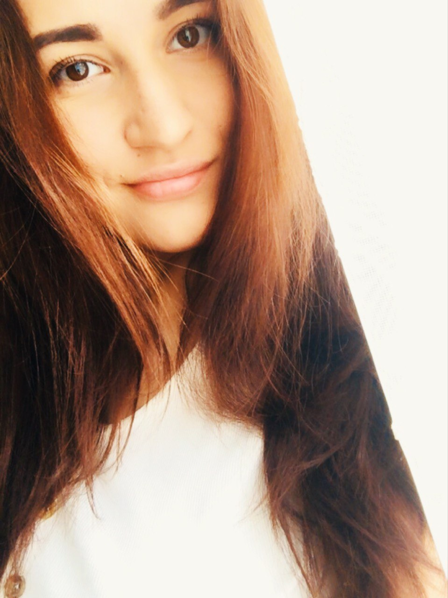

# Габдуллина Эльза Радиковна
## Обо мне
- - - 
* Возраст - 30 лет 
* Город - Казань
* Образование - высшее 
  - бакалавр-Педагогиечсекое образование; 
  - магистратура- Химическая технология
* Дополнительное образование - профессиональный перевод - английский язык
  

## Факты обо мне
- Моя девичья фамилия "Акмалова"
- Замужем 6 лет
- Тацевала на открытии Универсиады 2013
- Не представляю свою жизнь без кофе
- Ненавижу молоко
- Никогда не каталась и даже не стояла на коньках